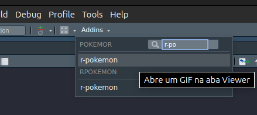
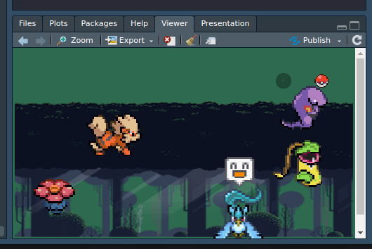
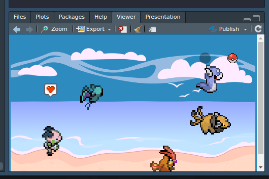
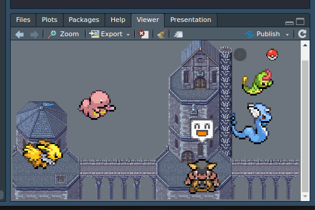

<div align="center">


**Pokémon animados direto no seu RStudio!**

[](https://www.r-project.org/)
[](https://posit.co/products/open-source/rstudio/)
</div>

---

## Sobre o  r-pokemon ⚡

O **r-pokemon** é um addin para RStudio inspirado no [vscode-pokemon](https://github.com/jakearl/vscode-pokemon) do Visual Studio Code.

Ele foi criado para mostrar aos alunos que a linguagem R pode ser igualmente divertida! ☺️

---

## Instalação

No console do RStudio, execute:

```r
install.packages("remotes")
remotes::install_github("miniguiti/r-pokemon")
```

Depois, reinicie a sessão:

> **Session → Restart R**

---

## Como usar

1. No menu superior, clique em **Addins**
2. Selecione a opção **r-pokemon**

O **Viewer** do RStudio abrirá com um cenário animado:



---

## Funcionalidades

| Botão | Ação |
|---|---|
| ➕ | Adiciona um novo Pokémon ao cenário (até 5) |
| 🔴 Pokébola | Gera um novo cenário com Pokémons aleatórios |
| 🖱️ Hover no Pokémon | Pokémon para e reage |
| 🖱️ Clique no Pokémon | Pokémon vira sua versão shiny ✨ |

**Cenários disponíveis:** Floresta 🌲 · Praia 🏖️ · Castelo 🏰

---

## Exemplos





---

## Contribua com o projeto! 🤝

Contribuições são muito bem-vindas, independentemente do nível. Aqui estão algumas formas de participar:
- **Quer melhorar o código R?** Faça um fork, edite e abra um Pull Request
- **Encontrou um bug?** Abra uma [issue](https://github.com/miniguiti/r-pokemon/issues) descrevendo o problema
- **Quer adicionar um Pokémon ou cenário?** Inclua os GIFs na pasta correspondente dentro de `inst/extdata/`

### Como contribuir (passo a passo)

```r
# 1. Faça um fork do repositório no GitHub
# 2. Clone o fork localmente e abra no RStudio
# 3. Edite e teste com devtools::load_all() e devtools::install()
# 4. Abra um Pull Request descrevendo sua contribuição
```

> Não precisa ser um expert em R, qualquer melhoria conta!